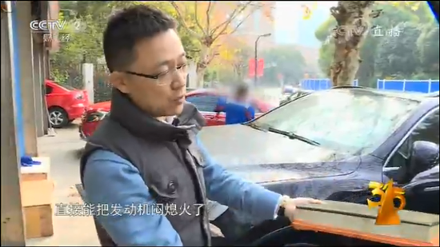

2018年315晚会结束，大众途锐汽车、枣庄金顺源、枣庄溢香园、酷骑单车等企业被点名。

## 第一枪：多地大众途锐汽车发动机进水问题

　　315晚会上第一个被曝光的品牌是大众汽车旗下途锐，多个消费者投诉了大众汽车旗下途锐汽车的一些问题。

　　随后，品牌官方给出回应称，该现象并非设计问题，并给出“拔掉排水阀”的解决方案。然而，车主认为这样的解决方式会影响车辆涉水等场景的正常使用，经过半年的等待，大众汽车才在315之前宣布了召回方案。

　　3月7日，大众宣布召回部分途锐汽车。大众称，将自2018年4月30日起，召回2014年12月21日至2017年11月12日期间生产的部分进口2015-2018年款途锐系列汽车。据该公司统计，中国大陆地区共涉及33142辆。

 
## 第二枪：农村市场仿冒名牌食品饮料横行

　　报道称：山东省枣庄市多家企业大量山寨核桃露、核桃花生饮料、杏仁露等市面上流行的饮品，有的甚至连包装设计也一并模仿。

　　金顺源食品有限公司，是山东枣庄众多食品加工长中的一家，央视记者看到该厂的一个池子，徐经理说是消毒用的。但消毒并不符合安全卫生要求。

　　“这款金顺源的产品并没有添加核桃，也没有添加花生，但外包装写着花生核桃，还印着花生核桃的图片。按照国家要求，预包装食品包装应真实准确，不得以虚假、夸大，以消费者误解或欺骗性的文字图形介绍食品，也不得利用字号大小和色差误导消费者。但金顺源没有做到。”

　　报道称：这些跟风模仿产品主要销往三四线城市及农村市场。

 
　　13日晚至14日上午，执法人员对三家企业的厂区环境、生产设施、原辅料储存、产品包装标示，以及进货验收、过程控制、出厂检验等情况进行了详细检查。检查发现，枣庄市康源食品有限公司未按食品生产许可规范要求组织生产，环境脏乱差，核桃乳产品配方中标注有核桃仁，而现场原料库中未发现核桃仁原料，该企业法人代表梁某某承认一直使用的是花生酱和核桃香精，没有使用过核桃仁，执法人员对库存812箱“鲁源”核桃乳予以查封

　　依据检查发现的违法行为，枣庄市食药监局对包括康源食品在内的三家企业立即进行立案查处，责令三家企业对涉事产品予以召回，依法对虚假标注、以假充真和商标侵权等违法行为移送市场监管部门立案处理;对两家涉嫌犯罪行为的企业移送公安部门处理。目前，两家企业的法人代表(负责人)梁某某、徐某已被公安部门依法控制。

　　晚会播出后，枣庄市康源食品有限公司宣布召回产品。

## 第三枪：进口保健品造假窝点被端

　　
 

## 第四枪：买珠宝抽大奖?全是套路

消费39元，抽中一等奖珠宝?真有这么好运?

 

　　销售人员演技到位、事先准备假票据，就为了骗顾客上钩。为啥一等奖这么容易中?老销售：全部都是一等奖。

## 第五枪：酷骑单车押金难退

　　央视315曝光酷骑单车官押金退不了，节目中有消费者表示：“酷骑单车押金退不了，相当于公开抢劫!” 这个事情已经好久啦，你的押金退了没?

　　本次晚会还关注了以下产品和服务问题：

　　大量建材企业在生产给水管和排水管时有意混淆国标和非标的产品标识。被点名的企业有：中谊建材有限公司、洛阳久通管业有限公司、江阴通顺有限公司、江阴大赢塑业有限公司。

　　武汉鑫锦程化工公司、武汉思方达交通设施工程有限公司、广州燕桦交通设施有限公司生产的不合格道路标线涂料产品。

　　各地打击刷单炒信等行为。

　　儿童穿洞洞鞋可能发生电梯意外。

　　大量日韩进口牙刷不符合国家标准。